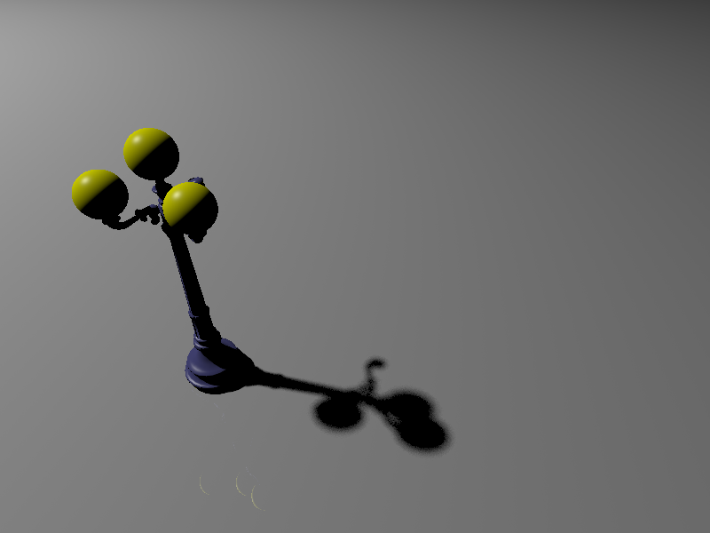
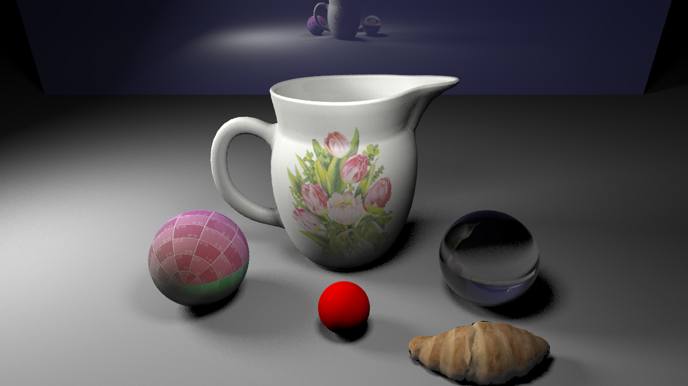

# 1. Monte Carlo Ray Tracing [Bonus 75 points]

**Note: in order to get any points for this assignment, your submitted code should be compilable and able to render and generate images. You must also mark the assignment as "completed" on Codio.**

In this assignment, you are going to extend your Olio program to be a Monte Carlo ray tracer, which will produce beautiful images. You will implement a new `AreaLight` class that will use stratified sampling to compute how a surface point is illuminated by it: when shadow rays are constructed, the area light's position is queried to return a random (stratified) position across its area - this will give you a good image that has soft shadows.

## DETAILS:

The area light is described by a new light type, using the scene file description:

```
l s x y z nx ny nz ux uy uz len r g b
```

describes a square area light, with center at [x y z], pointing in (normalized) direction [nx ny nz], with normalized u-direction [ux uy uz], and with the length of each side given by "len" - all these values are floats. The u-direction specifies one axis of the square, the same way it does for the image plane. The v-direction is just the u-direction cross product the pointing direction. [r g b] specifies the color and magnitude of the radiance of each point on the light source.

For example: `l s 0 10 0 0 -1 0 1 0 0 2 .5 .5 1.` describes a 2mx2m square area light, located 10 units above the XZ plane, pointing straight downwards (down Y that is), and with u-direction aligned with the X axis (and so the V direction is going to be aligned with the Z axis). It is blueish in color.

When you add an area light class to your code, you will have to develop a simple way to generate samples on its surface. As an example, if you were ignoring stratification, given two random parameters (ru, rv) on [0 1], the corresponding sample on the light is:

```
  XYZ + (ru - .5) * U * len + (rv - .5) * V * len
```

where xyz = [x y z], U=[ux uy uz], and V=[vx vy vz].

The random parameters can be generated by a call to `RandomReal()`, which returns a random floating point number in [0, 1). Improve the rendering quality by using stratified sampling: by splitting the area into square subdomains, and sampling there. Each "shadow ray" represents 1/N times the light's radiance; for example, if you are taking 4 shadow rays, each one contributes 1/4 of the light's emission. Each shadow ray's contribution should be scaled, as before, by the cosine of the angle between the surface normal and the direction to the specific light sample. Additionally, the energy contributed by each non-occluded shadow ray is scaled by 1/d^2 (one over the distance to that sample squared) AND by the cosine of the light's normal and the normalized direction to the surface point. Finally, the energy contribution by each non-occluded shadow ray needs to be scaled by the area of the light source.

To make this testable (and allow you the flexibility of testing it yourself), Olio should now accept a new command-line argument `-d` (`--shadow_samples`), which controls the sampling of the area lights. This argument specifies the number of shadow rays per hit surface point when computing the illumination at that point. The size of the grid that's used by the `AreaLight` during the stratified sampling should be the (rounded) square root of `shadow samples`. For example, a value of 10 for shadow samples will result in a `3x3` grid, and a value of 32 will result in a `6x6` grid.

Good luck, I look forward to seeing the results from this, the final assignment in ray tracing!

Rendering `data/scenes/streetlamp_scene.scn` with `--samples_per_pixel 1 --shadow_samples 16` should produce this image:



# 2. Support for area lights, triangle meshes, and BVHs [Bonus 15 points]

Add support for BVHs and TriMeshes by copying the relevant parts of your solution for HW5 to this project (while keeping your existing code for area lights). Your final renderer should be able to render `jug_croissant_spheres.scn` with options `-d 5 -a 5` under 2 minutes on Codio:

`<olio_rtbasic executable> -s data/scenes/jug_croissant_spheres.scn -o test.png -d 5 -a 5`


